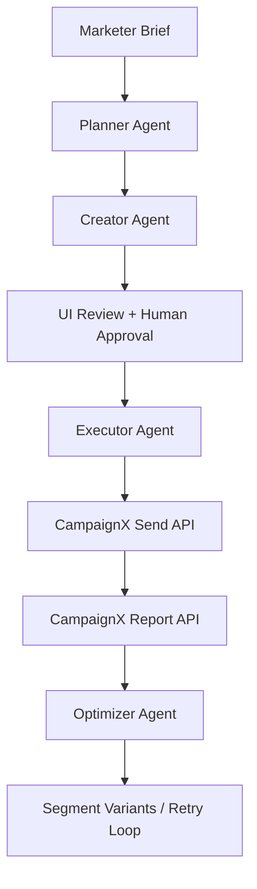

# CampaignX: AI Multi-Agent Email Campaign Automation

An agentic marketing workspace built for the CampaignX / FrostHack challenge. This project turns a natural-language campaign brief into an approval-ready email campaign, executes it through the provided CampaignX APIs, fetches live performance reports, and proposes optimized follow-up variants.

## Overview

This repository focuses on the full lifecycle of an email campaign for the SuperBFSI use case:

- Parse a marketer brief written in plain English
- Generate a campaign strategy and recommended send time
- Create compliant email copy with a strong click-oriented CTA
- Fetch the live customer cohort and filter matching recipients
- Keep a human in the loop before sending
- Execute campaigns through the CampaignX API
- Pull performance reports using OpenAPI-spec-driven tool discovery
- Analyze open and click outcomes
- Generate optimized micro-segment variants and relaunch loops

The app is designed as a practical hackathon MVP: readable, demo-friendly, and centered on agent behavior rather than a simple chatbot flow.

## Key Features

- Multi-agent workflow with separate planner, creator, executor, and optimizer stages
- Streamlit dashboard for brief intake, review, approval, execution, and optimization
- Spec-validated send and report execution grounded in the supplied OpenAPI spec
- Human-in-the-loop approval before campaign execution
- Live cohort fetching and audience filtering
- Baseline performance analysis using `EO` and `EC` report fields
- Optimization loop that can rewrite segment-specific variants, with autonomous relaunches gated behind explicit config
- Local LLM support via Ollama
- Validation and scoring helpers for copy quality and compliance

## Demo Flow

1. The marketer enters a campaign brief in the UI.
2. The Planner Agent generates strategy, audience hints, goals, and a future send time.
3. The Creator Agent generates multiple subject/body variants and picks the strongest one.
4. The Executor Agent fetches the cohort, filters customers, and prepares the send payload.
5. A human reviews the generated campaign and approves execution.
6. The system sends the campaign through the CampaignX API.
7. The Optimizer Agent fetches reports, computes open/click metrics, and proposes improved variants.
8. Optional optimization loops relaunch refined versions for selected segments.

## Architecture



## Agent Responsibilities

### Planner Agent

File: `agents/planner.py`

- Converts a free-form brief into structured JSON
- Produces strategy, target audience hints, goals, and an engagement-aware future send time
- Preserves special campaign instructions such as broad targeting or explicit subgroup mentions

### Creator Agent

File: `agents/creator.py`

- Generates multiple subject lines and body versions
- Selects a best-performing candidate oriented toward click-through rate
- Enforces content hygiene:
  - English-only copy
  - no HTML in generated body content
  - no invented claims or unsupported facts
  - only approved URLs
- Falls back to safe generic content if model output is invalid

### Executor Agent

File: `agents/executor.py`

- Reads the OpenAPI spec from `data/superbfsi_api_spec.yaml`
- Plans and validates API calls for:
  - campaign sending
  - report fetching
- Fetches the live customer cohort directly from the CampaignX cohort endpoint, with local fixture fallback only when explicitly enabled for demo/offline runs
- Validates payloads against hackathon policy constraints
- Executes approved API requests with the CampaignX API key
- Supports batching and filtered audience execution

### Optimizer Agent

File: `agents/optimizer.py`

- Fetches campaign reports and computes:
  - open rate
  - click rate
  - weighted performance score
- Generates micro-segment ideas and optimized email variants
- Supports a retry loop that can:
  - send a version
  - fetch report data
  - critique weak results
  - rewrite the email
  - relaunch within retry limits

## Tech Stack

- Python
- Streamlit
- LangChain
- Ollama
- Pydantic
- Requests
- PyYAML
- CampaignX / SuperBFSI APIs

## Repository Structure

```text
Agentic_Ai/
|-- agents/
|   |-- audience_matching.py
|   |-- campaign_sender.py
|   |-- cohort_service.py
|   |-- creator.py
|   |-- executor.py
|   |-- optimizer.py
|   |-- planner.py
|   `-- spec_planning.py
|-- models/
|   `-- shared.py
|-- assets/
|   `-- style.css
|-- data/
|   |-- customer_cohort.json
|   `-- superbfsi_api_spec.yaml
|-- tests/
|   |-- test_agents.py
|   |-- test_content_helpers.py
|   |-- test_executor.py
|   |-- test_ollama.py
|   |-- test_optimizer.py
|   `-- test_ui_helpers.py
|-- ui/
|   |-- components.py
|   |-- optimizer_flow.py
|   `-- review_flow.py
|-- utils/
|   |-- __init__.py
|   |-- ollama_client.py
|   |-- scorer.py
|   |-- settings.py
|   |-- text.py
|   `-- validator.py
|-- app.py
|-- requirements.txt
`-- README.md
```

## Setup

### 1. Clone the repository

```bash
git clone <your-repo-url>
cd Agentic_Ai
```

### 2. Create and activate a virtual environment

Windows PowerShell:

```powershell
py -3 -m venv .venv
.venv\Scripts\Activate.ps1
```

macOS / Linux:

```bash
python3 -m venv .venv
source .venv/bin/activate
```

### 3. Install dependencies

```bash
pip install -r requirements.txt
```

### 4. Configure environment variables

Copy `.env.example` to `.env` and update the values:

```env
OLLAMA_MODEL=llama3.1:8b
CAMPAIGNX_API_KEY=your_campaignx_api_key_here
CAMPAIGNX_DEBUG_LLM=false
CAMPAIGNX_DEBUG_EXECUTION=false
CAMPAIGNX_CTA_MODE=raw_url
CAMPAIGNX_ALLOW_LOCAL_COHORT_FALLBACK=false
CAMPAIGNX_OPTIMIZER_AUTO_APPROVE_SENDS=false
```

Required variables:

- `OLLAMA_MODEL`: local Ollama model name used by the agents
- `CAMPAIGNX_API_KEY`: API key for customer cohort fetch, campaign sending, and reporting

Optional variables:

- `CAMPAIGNX_DEBUG_LLM`: enables verbose Ollama client logging
- `CAMPAIGNX_DEBUG_EXECUTION`: enables redacted executor HTTP/debug logging
- `CAMPAIGNX_CTA_MODE`: controls CTA rendering in email bodies (`raw_url`, `labeled_plain`, or `html_anchor`)
- `CAMPAIGNX_ALLOW_LOCAL_COHORT_FALLBACK`: allows `data/customer_cohort.json` fallback only for explicit demo/offline runs
- `CAMPAIGNX_OPTIMIZER_AUTO_APPROVE_SENDS`: allows optimizer relaunch sends without per-retry human approval; default should remain `false`

### 5. Start Ollama

Make sure Ollama is installed and the selected model is available locally.

Example:

```bash
ollama pull llama3.1:8b
ollama serve
```

### 6. Run the app

```bash
streamlit run app.py
```

Then open the local Streamlit URL shown in the terminal.

## How To Use

### In the Streamlit app

1. Enter a campaign brief for the email campaign.
2. Review the generated strategy, audience, send time, and email content.
3. Inspect the fetched customer cohort and selected recipients.
4. Approve the campaign in the UI.
5. Execute the campaign.
6. Fetch live metrics and run optimization.
7. Review optimized micro-segment variants and optional retry loops.

### Example brief

```text
Run an email campaign for launching XDeposit, a term deposit product from SuperBFSI.
Highlight that it offers 1 percentage point higher returns than competitors and an
additional 0.25 percentage point higher returns for female senior citizens.
Optimize for click rate and open rate. Do not exclude inactive customers.
Include the call to action: https://superbfsi.com/xdeposit/explore/
```

## Dynamic API Discovery

One of the important parts of this project is that send and report execution are validated against the supplied OpenAPI spec. The executor and optimizer use the spec to:

- build the allowed send/report proposal shape
- validate method and path choices
- enforce required payload and query keys

Customer cohort fetch is currently a direct endpoint call rather than a spec-planned operation.

## Metrics and Optimization Logic

The optimizer currently uses report rows returned by the CampaignX report endpoint and computes:

- `open_rate` from `EO == "Y"`
- `click_rate` from `EC == "Y"`
- weighted score using a stronger click emphasis

The project follows the challenge evaluation preference by prioritizing click-through rate while still protecting open rate quality.

## Validation and Scoring Utilities

Supporting modules include:

- `utils/validator.py` for subject/body validation and payload checks
- `utils/scorer.py` for ranking and reasoning across generated variants

These utilities help the generated content stay closer to the problem constraints and make the output more demo-ready.

## Testing

Basic test and validation files are included, such as:

```bash
py -3 -m compileall agents app.py utils
```

And:

```bash
py -3 -m unittest tests.test_executor tests.test_optimizer tests.test_agents tests.test_content_helpers tests.test_ollama
```

This test suite uses the Python standard library `unittest`, so no extra test dependency is required.

## Known Limitations

- This is a hackathon-oriented MVP and not a production deployment
- The UI is Streamlit-based and optimized for local demo flows
- Real campaign quality depends on the selected Ollama model
- API availability and report freshness depend on the external CampaignX service
- The project currently focuses on email-only workflows from the broader problem statement

## Why This Project Stands Out

- It goes beyond copy generation and covers planning, execution, reporting, and optimization
- It keeps a human approval checkpoint before sending
- It includes OpenAPI-spec-driven behavior instead of only static API calls
- It explicitly optimizes around the challenge metric weighting

## Future Improvements

- Better observability for agent reasoning and API traces
- Stronger automated tests across agent boundaries
- Persistent storage for campaign runs and approvals
- More advanced customer segmentation and experiment tracking
- Dashboard visualizations for multi-run campaign comparisons

## Contributing

If you are adapting this project for your own demo or extending it after the hackathon:

- keep agent boundaries clear
- preserve the approval gate before sending
- validate all outbound campaign payloads
- document any new environment variables and API assumptions

## License

Add your preferred license here before publishing publicly.
